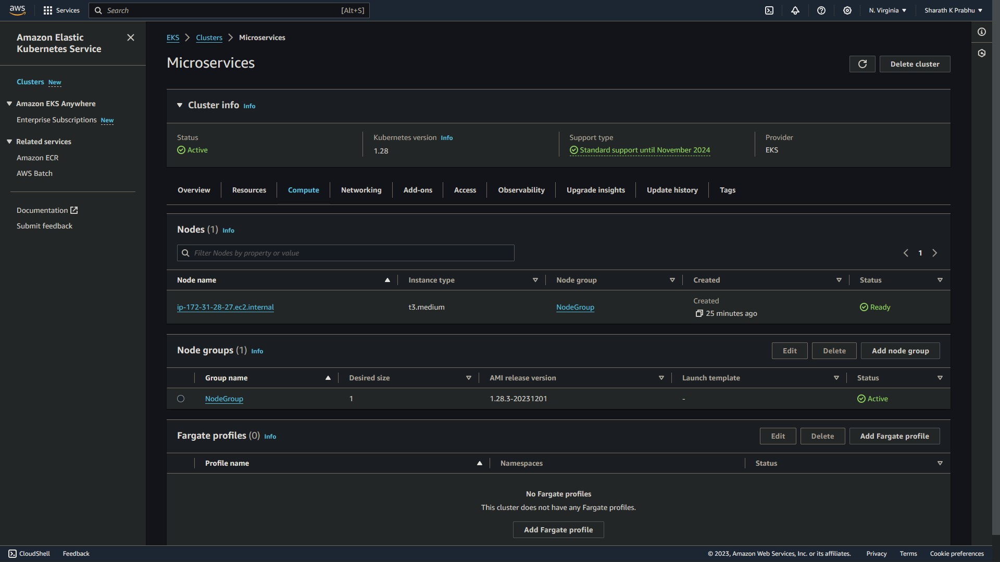
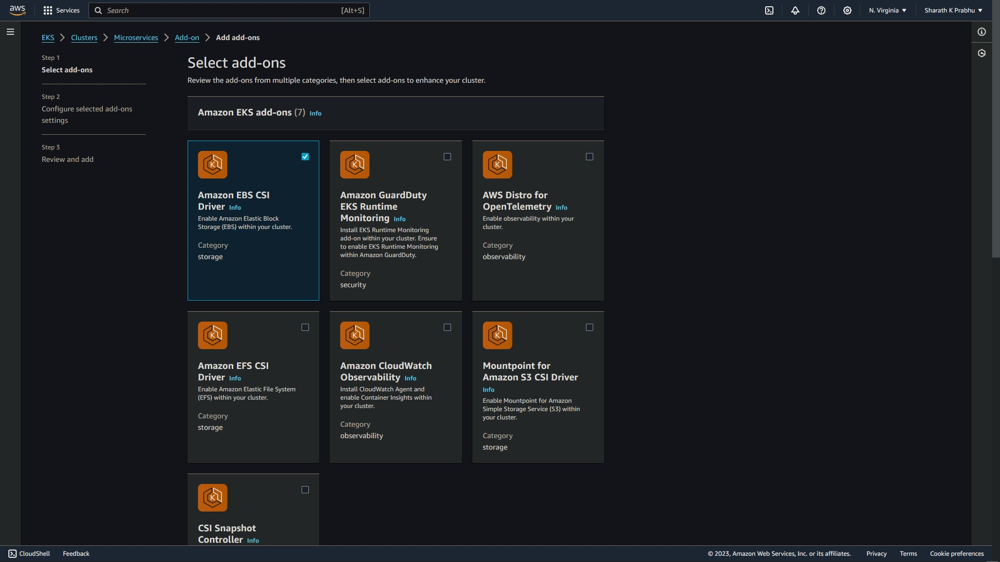

# __Python Microservices App using AWS EKS__

This project implements a __Python-based Microservice Application__ on __AWS Elastic Kubernetes Services__ (*EKS*). 

<br>
<p align="center">
  
</p>

The application consists of 4 major microservices:
  * __auth-server__: Provides authentication through the __PostgresDB__ that produces a `JWT token` for accessing other servers.
  * __converter-module__: Performs the _Video to Audio conversion_ using __Python Modules__.
  * __database-server__: The __MongoDB Server__ is used to store the audio and video files.
  * __notification-server__: The __RabbitMQ__ performs the message queuing service for incoming video, and provides a notification on the progress of the conversion. 

All these functions are deployed as individual _microservices_ on the __AWS EKS__ as individual _Dockerized containers_.

## **Prerequisites**

  Before you begin, ensure that the following prerequisites are met:

  1. **Create an AWS Account:** Create an __[AWS](https://docs.aws.amazon.com/streams/latest/dev/setting-up.html)__ account if you don't have one.

  2. **Python:** Ensure that __[Python](https://www.python.org/downloads/)__ is installed on your system.

  3. **AWS CLI:** Install the __LATEST and STABLE VERSION__ of __[AWS CLI](https://docs.aws.amazon.com/cli/latest/userguide/getting-started-install.html)__ following the official documentation.

  4. **Install kubectl:** Install the __LATEST and STABLE VERSION__ of __[kubectl](https://kubernetes.io/docs/tasks/tools/)__ on your system following the official documentation.

  5. **Databases:** Set up __[MongoDB](https://www.mongodb.com/docs/manual/installation/)__ for your application.

  6. **Databases:** Set up PostgreSQL and MongoDB for your application.

<br>

  __NOTE__: _This project will cost you some money based on your location for AWS EKS._

<br>
<p align="center">
  
</p>

## __Implementation__

_Follow the **[Screenshots](./Screenshots/)** for reference!_

### __1. Create IAM Roles for access permissions__

   * __Log in to AWS Console:__
      - Access the AWS Management Console with your AWS account credentials.

   * __Create eksCluster IAM Role__
      - Follow this __[Documentation](https://docs.aws.amazon.com/eks/latest/userguide/service_IAM_role.html)__ steps using the root user credentials for creating the IAM Role.
      - The IAM Role should like as follows after creation:

      <br>
      <p align="center">
      
      </p>

      - Attach the __AmazonEKS_CNI_Policy__ explicitly if it is not attached by default.

      <br>

   * __Create Node Role - AmazonEKSNodeRole__
      - Follow this __[Documentation](https://docs.aws.amazon.com/eks/latest/userguide/service_IAM_role.html)__ steps using the root user credentials for creating the IAM Role.
      - Please note that you do NOT need to configure any VPC CNI policy mentioned after step 5.e under mentioned in the documentation.
      - Attach the following policies to your role once you have created if not attached.
  
        * __AmazonEKS_CNI_Policy__
        * __AmazonEBSCSIDriverPolicy__
        * __AmazonEC2ContainerRegistryReadOnly__

      - Your AmazonEKSNodeRole will look like this after creation: 

      <br>
      <p align="center">
        
      </p>
      <br>

### __2. Create the AWS EKS Cluster__

   * **Open EKS Dashboard:**
      - Navigate to the Amazon EKS service from the AWS Console dashboard.

   * **Create EKS Cluster:**
      - Click "Create cluster."
      - Choose a name for your cluster.
      - Configure networking settings (VPC, subnets).
      - Choose the `eksCluster` IAM role that was created above
      - Review and create the cluster.

   * **Cluster Creation:**
      - Wait for the cluster to provision, which may take several minutes.

   * **Cluster Ready:**
      - Once the cluster status shows as "Active," you can now create node groups.

  <br>
  <p align="center">
    
  </p>

### __3. Create Node Groups for Cluster__

   * In the "__Compute__" section, click on "__Add node group__".

   * Choose the default AMI (__Amazon Linux 2__), instance type (e.g., __t3.medium__), and set the number of nodes to 1.

  <br>
  <p align="center">
    
  </p>

  <p align="center">
    
  </p>

   * Click "__Create__".

   <br>
   <p align="center">
    
   </p>

  * **Enable EBS CSI Addon:**

    Add an additional add-on __EBS CSI__. This enables _Persistent Volume Claims_ once cluster is created.

<br>
<p align="center">
  
</p>
<br>

**NOTE:** Ensure that all the necessary ports are open in the node security group by allowing all the __Inbound Rules__ and __Outbound Rules__ for your network.

<br>
<p align="center">
  
</p>
<br>

### __4. Configuring and deploying the Databases and Message Queue__

* Clone the code from this repository.
   ```
   git clone https://github.com/maxlr8/aws_eks_microservices.git
   ```

* Set the cluster context:
   ```
   aws eks update-kubeconfig --name <cluster_name> --region <aws_region>
   ```

<br>
<p align="center">
  
</p>

<br>

   * __Configure and Install MongoDB__
      - Set database username and password in __[values.yaml](./Helm%20Charts/MongoDB/values.yaml)__ file.
      - Navigate to the __[MongoDB Helm Chart](./Helm%20Charts/MongoDB/)__ folder.

        ```
        cd Helm_charts/MongoDB
        ```

      - Install MongoDB.

        ```
        helm install mongo .
        ```

      <br>
      <p align="center">
        
      </p>
      <br>

      - Test the database connectivity.

      <br>
      <p align="center">
        
      </p>
      <br>

   * __Configure and Install Postgres__
      - Similalrly, set database username and password in __[values.yaml](./Helm%20Charts/Postgres/values.yaml)__ file.
      - Navigate to the __[PostgresDB Helm Chart](./Helm%20Charts/Postgres/)__ folder.

        ```
        cd Helm_charts/Postgres
        ```

      - Install Postgres.

        ```
        helm install postgres .
        ```

        <br>
        <p align="center">
          
        </p>
        <br>

      - Test the database connectivity and run the SQL command to setup a table and value. 
      - Replace your working __Gmail ID__ in the query.

        <br>
        <p align="center">
          
        </p>

   * __Install RabbitMQ__
      - Navigate to the __[RabbitMQ Helm Chart](./Helm%20Charts/RabbitMQ/)__ folder.

        ```
        cd Helm_charts/RabbitMQ/
        ```

      - Install RabbitMQ.

        ```
        helm install rabbitmq .
        ```

        <br>
        <p align="center">
          
        </p>
        <br>

      - Login to the server with default credentials for both username ans password __*guest*__.

        <br>
        <p align="center">
          
        </p>
        <br>
 
      - Create queues for the input audio and video files.

        <br>
        <p align="center">
          
        </p>

<br>

### __5. Creating and deploying microservices__

* Create and deploy docker containers for all the 4 microservices -
  * __[auth-service](./src/auth-service/)__
  * __[gateway-service](./src/gateway-service/)__
  * __[converter-service](./src/converter-service/)__
  * __[notification-service](./src/notification-service/)__

* For each of the service deployment (ex. __[auth-service](./src/auth-service/)__): 
  * Navigate to the main directory and build the docker image.

    ```
    docker build -t auth .
    ```

    <br>
    <p align="center">
      
    </p>
    <br>

  * Create a repository on the docker hub.
  * Tag the local image with the name of the remote repo name.

    <br>

    ```
    docker tag auth:latest <user_name>/auth
    ```

    <br>
    <p align="center">
      
    </p>
    <br>

  * Push the image.

    <br>

    ```
    docker push <user_name>/auth
    ```

    <br>
    <p align="center">
      
    </p>

    <br>
    <p align="center">
      
    </p>
    <br>

  * Change the directory to manifest.

    <br>

    ```
    cd ./manifest
    ```

  <br>

  * Apply the manifest to the microservice.

    <br>

    ```
    kubectl apply -f .
    ```

    <br>
    <p align="center">
      
    </p>
    <br>

  Now, similarly perform the same steps for the rest of the services: __gateway-service__, __converter-service__ and __notification-service__.

    <br>

  **NOTE**: 
  * Check through every file in the __[source](./src)__ folder and fill the place-holders accordingly.

  * Before deploying the __notification microservice__, perform the following configuring to your __GMAIL__ account to let external application access and receiving notifications.

    1. Go to your Gmail account and click on your profile.

    2. Click on "__Manage Your Google Account__"

    3. Navigate to the "__Security__" tab on the left side panel.

    4. Enable "__2-Step Verification__"

    5. Search for the application-specific passwords. You will find it in the settings.

    6. Click on "__Other__" and provide your name.

    7. Click on "__Generate__" and copy the generated password.

    8. Paste this generated password in the __[notification secret](./src/notification/manifest/secret.yaml)__ file along with your __email__.

  <br>

* Perform a validation step to see all the services, replicas and pods running on the cluster.

    <br>

    ```
    kubectl get all
    ```

    <br>
    <p align="center">
      
    </p>

    <br>

### __6. Test the application__

- **Login Endpoint**

    <br>

    ```http request
    POST http://nodeIP:30002/login
    ```

    <br>

    Replace the __nodeIP__ with the EC2 public IP of the EC2 instance used by the AWS EKS, and __email__ and __password__ with the ones registerd in the __postgres db__ stored

    <br>

    ```console
    curl -X POST http://nodeIP:30002/login -u <email>:<password>
    ``` 

    <br>

    The output is a **JWT Token**.

    <br>
    <p align="center">
      
    </p>
    <br>

    Save the **JWT Token**.

    <br>

- **Upload Endpoint**

    <br>

    ```http request
    POST http://nodeIP:30002/upload
    ```

    <br>

    Replace the __JWT Token__ and the __nodeIP__ similar to the previous step.

    <br>

    ```console
    curl -X POST -F 'file=@./video.mp4' -H 'Authorization: Bearer <JWT Token>' http://nodeIP:30002/upload
    ``` 

    <br>
    <p align="center">
      
    </p>
    <br>

    * The expected output is: __success!__ as above.
    * Check for the ID of the converted file on the __MongoDB__ passed onto your __Gmail__.

    <br>

    <br>
    <p align="center">
      
    </p>
    <br>

- **Download Endpoint**

    <br>

    Download the file by replace the __JWT Token__, __nodeIP__ and the __video ID__ received on your Gmail.

    <br>

    ```console
    curl --output video.mp3 -X GET -H 'Authorization: Bearer <JWT Token>' "http://nodeIP:30002/download?fid=<Generated fid>"
    ```

    <br>
    <p align="center">
      
    </p>
    <br>

## __Destroying the Infrastructure__

To clean up the infrastructure, follow these steps:

1. First, delete the __Node Group__ associated with your __EKS Cluster__.

2. Once the __Cluster Nodes__ are deleted, delete the __EKS cluster__.